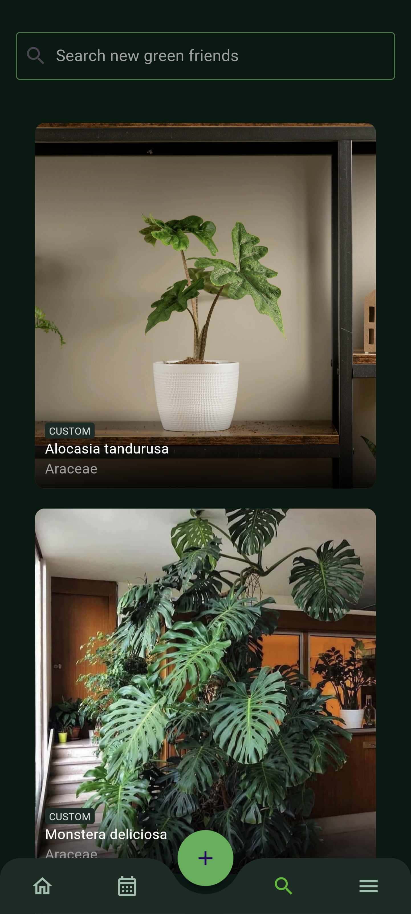
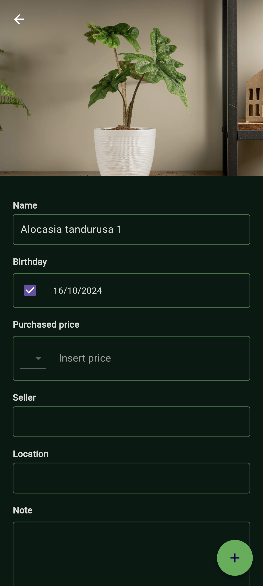
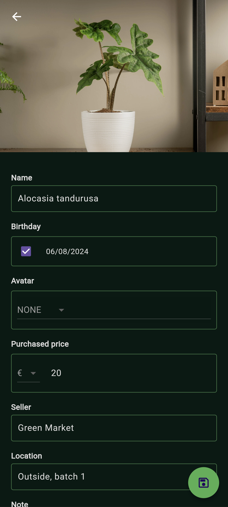
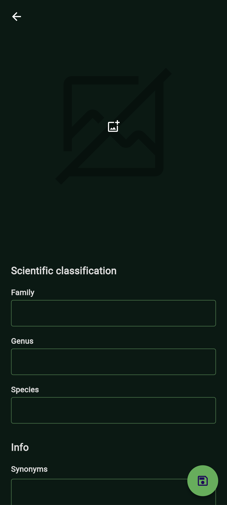
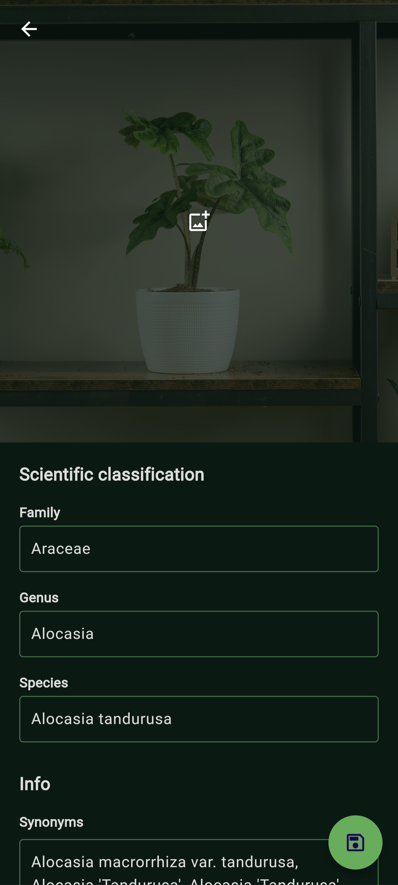
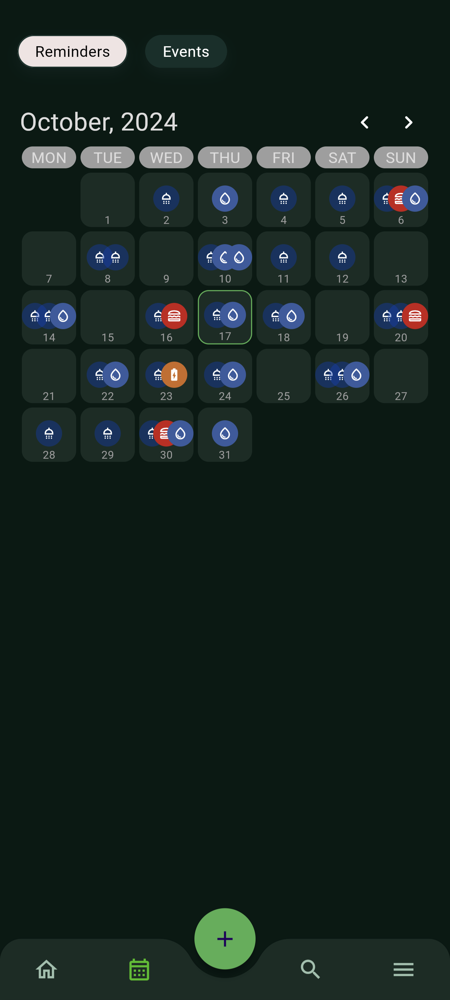

# Features

## Homescreen
{ align=left; loading=lazy; style="height:600px;"}

The app's home screen is designed to provide users with a comprehensive view of their stored plants and associated events. On this screen, users can easily view the latest chronological events related to their plants and access a list of the plants they own.

## Plant
### Add a new plant
{ align=left; loading=lazy; style="height:600px;"}
{ align=left; loading=lazy; style="height:600px;"}
{ align=left; loading=lazy; style="height:600px;"}

To add a new plant, simply tap the search icon in the bottom bar. From there, you can either add a custom species or, if you setup a FloraCodex key, explore and add existing species to your collection.

Upon identifying the plant species, select it, click on "Add plant" at the bottom of the page, then input the necessary information, and proceed by clicking the "Add" button. For those without a FloraCodex key or wishing to add a new species, opt for the "Custom" species option, provide the required details, and then click on the "Save plant" button.

### View details
{ align=left; loading=lazy; style="height:600px;"}
{ align=left; loading=lazy; style="height:600px;"}
{ align=left; loading=lazy; style="height:600px;"}

To view detailed information about a plant, open it from the home screen. You’ll see a comprehensive overview, including details about the plant and its associated species.

* In the "Activity" section, you can find events and reminders specific to that plant.
* The "Plant" section provides detailed information about the individual plant.
* The "Species" section contains information about the plant’s species.

### Edit details or remove plant
{ align=left; loading=lazy; style="height:600px;"}

To modify plant details, select the plant, then click on the edit icon in the bottom appbar of the view, proceed to update the information, and click the "Update" floating button. For plant deletion, click the trash icon in the bottom appbar of the view.

## Events
### Add a new event
{ align=left; loading=lazy; style="height:600px;"}

To create a new event, simply tap the plus button in the bottom bar. From there, you can link one or multiple plants, select one or multiple event types, choose the date, and insert a note. Complete the process by clicking the "Add" floating button.

### View all events
{ align=left; loading=lazy; style="height:600px;"}

To access all saved events, select the "calendar" icon in the button bar, then click on the "Events" section. Here, you'll find a chronological list of all events, and you can further filter them by plants and/or type for convenient organization.

### Edit or remove existing event
{ align=left; loading=lazy; style="height:600px;"}

To modify or delete an event, choose it from either the home screen or the "diary" view within the app. Subsequently, click on the "Remove" button in order to remove it, or change the information and then click on the "Save" floating button.

## Species
### Create new species
{ align=left; loading=lazy; style="height:600px;"}
{ align=left; loading=lazy; style="height:600px;"}

To add a new species, tap the search icon in the bottom bar, enter the species name, and select the "Custom" species option. Enter the necessary details and then click "Save plant" to create the new species.

### Edit existing species
{ align=left; loading=lazy; style="height:600px;"}
{ align=left; loading=lazy; style="height:600px;"}

To modify an existing species, tap the search icon in the bottom bar, enter the species name, and select it. Next, click the edit icon in the bottom appbar of the window, make the necessary updates, and then click the floating "Save" button. The species will be updated. If it originated from the FloraCodex service, a new custom species will be generated, and all plants linked to the FloraCodex species will be associated with the new one. If it was already a custom species, it will be straightforwardly updated.

### Remove existing species
To delete a species, it must be a custom one. Tap the search icon in the bottom bar, enter the species name, and select it. Next, click the trash icon in the bottom appbar of the window,. Please be aware that this action will also delete all linked plants associated with the species.

## Reminders
The Reminder feature in the project allows users to set up reminders for specific actions related to their plants.

### View Upcoming Reminder Occurrences
{ align=left; loading=lazy; style="height:600px;"}
{ align=left; loading=lazy; style="height:600px;"}
To see the upcoming reminder occurrences for your plants, follow these steps:

* Open the Calendar: Click on the "Calendar" icon located in the bottom bar of the app.
* Navigate to the Reminder Section: Once in the Calendar view, switch to the "Reminder" section. Here, you'll find a calendar displaying all scheduled reminder occurrences.
* View Daily Details: Click on a specific day in the calendar to see a detailed list of reminder occurrences, along with the associated plants. This allows you to quickly check which tasks need attention on a particular day.

### Add a new reminder
{ align=left; loading=lazy; style="height:600px;"}
{ align=left; loading=lazy; style="height:600px;"}

Follow the steps below to create a new reminder:

* Navigate to Plant Detail View: Open the detail view of the desired plant by selecting it from the plant list. Once in the detail view, locate and click on the "Activity" section.
* Access Reminders Section: Within the "Activity" section, scroll down until you find the "Reminders" subsection. Here, you can manage existing reminders, including removing or disabling them, as well as creating new ones.
* Create a New Reminder: To create a new reminder, click on the "add" icon provided in the reminders section.
* Fill Required Information: You will be prompted to fill in the following required information for the new reminder:
    * Type: Specify the type of action to be reminded of.
    * Start Date: Set the date from which you want the reminders to start.
    * Frequency: Choose how often you want to be reminded if the specified action is not completed for the plant.
    * Repeat After: Optionally, set a time interval after which reminders should be sent again if the action remains incomplete.
    * End Date: Optionally, provide an end date for the reminder.
    * Enabled: Toggle the reminder on or off as needed.
* Save Reminder: After filling in the required information, save the reminder to activate it for the selected plant.

### Edit or delete a reminder
{ align=left; loading=lazy; style="height:600px;"}

In order to edit or delete an existing reminder click on it.
Edit the information as needed and then click on the floating "Save" button in order to update it, or click on the trash icon in the upper right in order to delete the reminder.

### Reminder notification
{ align=left; loading=lazy; style="height:600px;"}

The Reminder Dispatcher feature in the application allows users to customize how they receive notifications for expired reminders. Follow the steps below to change the reminder dispatcher:

* Access App Settings: Navigate to the application's settings by locating and clicking on the settings icon in the bottom bar
* Open Reminder Notification Settings: Within the settings menu, look for the "Notifications" section or option. Click on it to access the reminder notification settings.
* Select Dispatcher: In the reminder notification settings, you will find options to configure the reminder dispatcher. Choose the desired dispatcher by checking the corresponding checkbox.
* Save Changes: After selecting the desired reminder dispatcher, save the changes to apply the new notification settings.
